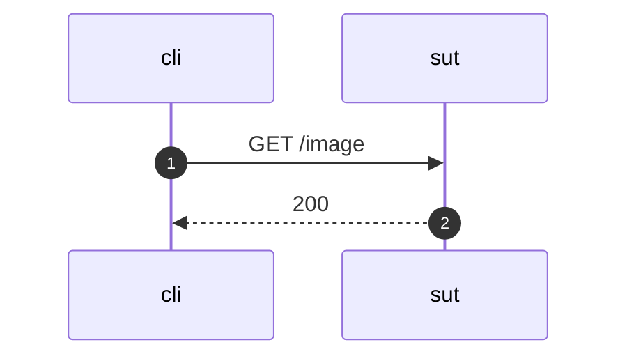

## GET /image

  

  
## Event log
#### Event 1
  
GET /image HTTP/1.1  
Host: sut  
  

  
---
  
#### Event 2
  
HTTP/1.1 200 OK  
Content-Length: 40682  
Content-Type: image/png  
  

  

  
---
  