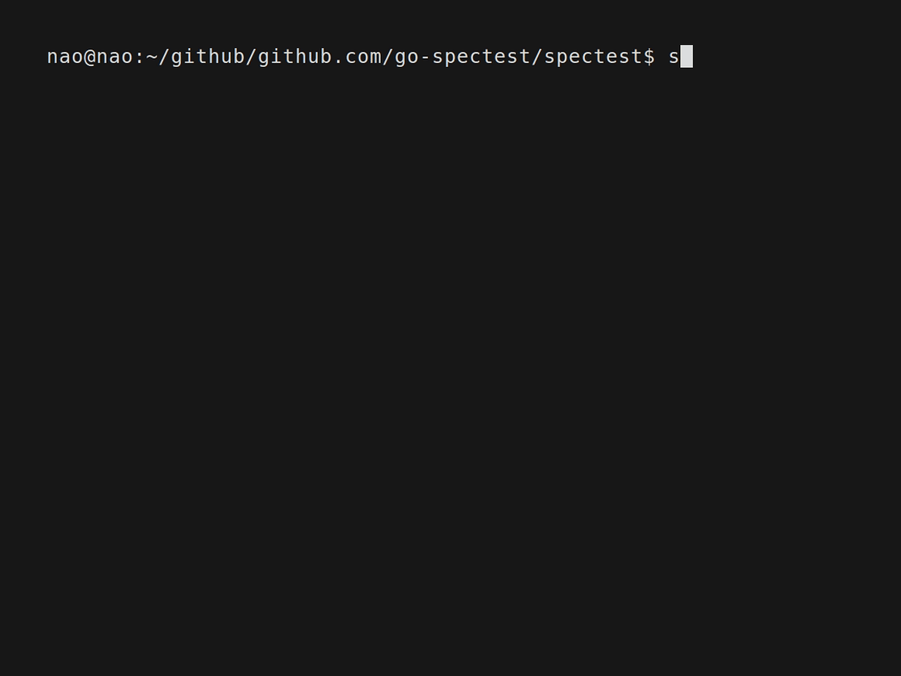
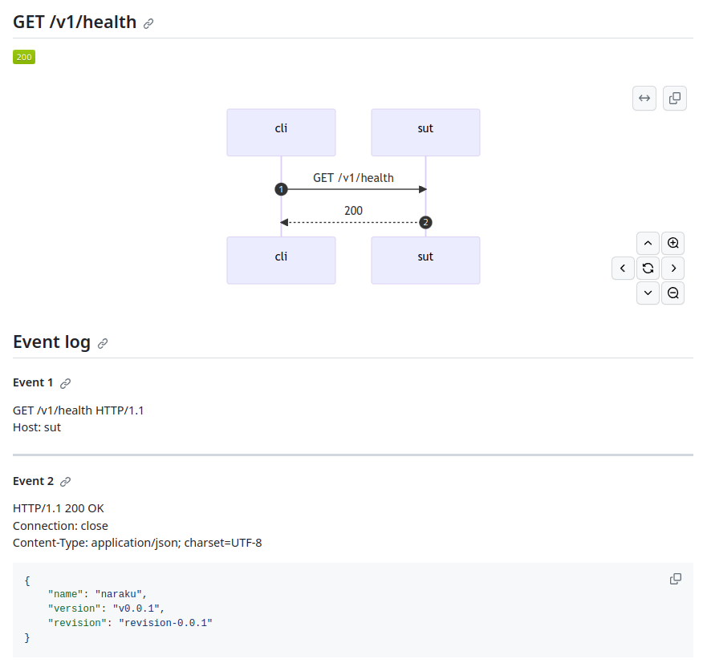
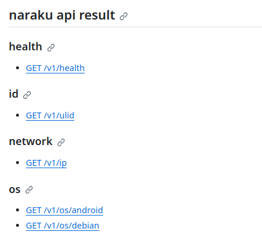

# Use Cases of spectest
## Installation of spectest cli
```shell
go install github.com/go-spectest/spectest/cmd/spectest@latest
```

## User-friendly 'go test'  
The spectest offers a wrapper for the `go test` command. The spectest command adds the "-v" option to the go test options provided by the user and executes the tests. Successful test results are represented by green ".", while failed tests are represented by red ".". Upon completion of the tests, it displays information about the failed tests and summarizes the test results.



Some portions of the code in this feature were forked from [rakyll/gotest](https://github.com/rakyll/gotest). gotest command is licensed under [the BSD 3-Clause "New" or "Revised" License](./gotest/LICENSE).

## Generating Markdown documents from E2E test results
The spectest offers numerous features that are not available in its forked counterpart, [steinfletcher/apitest](https://github.com/steinfletcher/apitest). While apitest was a simple library, spectest provides functionalities both as a library and a CLI (Command Line Interface).
  
The current version of spectest is gradually upgrading its documentation generation capabilities. Instead of generating HTML documents, it aims to preserve End-to-End (E2E) test results as documents in Markdown format for developers working on GitHub.
  
### Simple usecase for generating test results
1. You create unit tests for your API endpoints with spectest.
2. You run the tests and auto generate Markdown documents with the test results.
3. When you run `spectest index`, spectest generates an index markdown for a directory full of markdown file.
  
#### Test code example
For example, let's consider an API that returns the health check of a server (GET /v1/health). The code to test the status code and body of this API is as follows:
  
```go
func TestHealthCheck(t *testing.T) {
	spectest.New().
        Report(spectest.SequenceReport(spectest.ReportFormatterConfig{
			Path: filepath.Join("docs", "health"),
			Kind: spectest.ReportKindMarkdown,
		})).
		CustomReportName("health_success").
		Handler(api).
		Get("/v1/health").
		Expect(t).
		Body(`{"name": "naraku", "revision": "revision-0.0.1", "version":"v0.0.1"}`).
		Status(http.StatusOK).
		End()
}
```

In spectest.SequenceReport, you specify the "output destination for E2E test results" and indicate that the results should be output in Markdown format. With CustomReportName, you specify the filename for the Markdown file. The above code will generate a Markdown file named "docs/health/health_success.md".

#### Markdown file example


#### Index file example
When you write numerous unit tests, it results in the generation of multiple Markdown files containing E2E test results. It can become challenging for you to reference all these Markdown files individually. Therefore, you can use the spectest CLI to generate an index file with links to the Markdown files.

You execute the following command to generate an index file:
```shell
spectest index docs --title "naraku api result" 
```

[Output](https://github.com/go-spectest/naraku/blob/main/docs/index.md):  



## Use golden file for E2E test
Golden File reduces your effort to create expected value data. The spectest can use a Golden File as the response body for the expected value. The Golden File will be overwritten with the actual response data in one of the following cases;
- If the Golden File does not exist in the specified path
- If you run the test with `go test -update . /...`

### How to use
```go
		handler := http.NewServeMux()
		handler.HandleFunc("/hello", func(w http.ResponseWriter, r *http.Request) {
			w.WriteHeader(http.StatusOK)
			w.Header().Set("Content-Type", "application/json")
			if _, err := w.Write([]byte(`{"a": 12345}`)); err != nil {
				t.Fatal(err)
			}
		})

		spectest.New().
			Handler(handler).
			Get("/hello").
			Expect(t).
			BodyFromGoldenFile(filepath.Join("testdata", "golden.json")). // use golden file
			Status(http.StatusOK).
			End()
```
