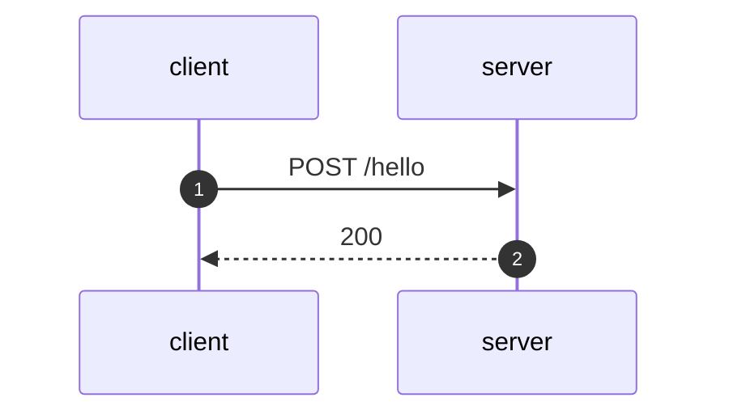

## POST /hello

  

  
## Event log
#### Event 1
  
POST /hello HTTP/1.1  
Host: server  
  

  
---
  
#### Event 2
  
HTTP/1.1 200 OK  
Connection: close  
Content-Type: application/json  
  

  
```json
{
    "a": 12345
}
```
  
---
  